# Metro-Passenger-Flow-Anomaly-Detection
Reimplemention and improvement of the paper "[Real-Time Passenger Flow Anomaly Detection Considering Typical Time Series Clustered Characteristics at Metro Stations](https://ascelibrary.org/doi/abs/10.1061/JTEPBS.0000333)"

## Dataset

The AFC system records the number of passengers who are inbound to and outbound from stations. The passenger flow dataset collected from a metro station during 402 days, are utilized. The AFC data were collected at 5-min intervals.

Due to the varying operating hours of metro stations on different dates, in order to ensure unification of data, using daily data from 6:00 to 23:00.

The following figtures show the curves of the passenger flow data.

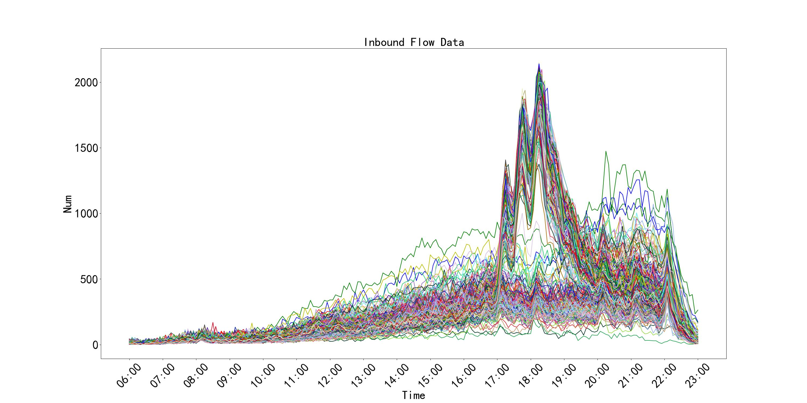

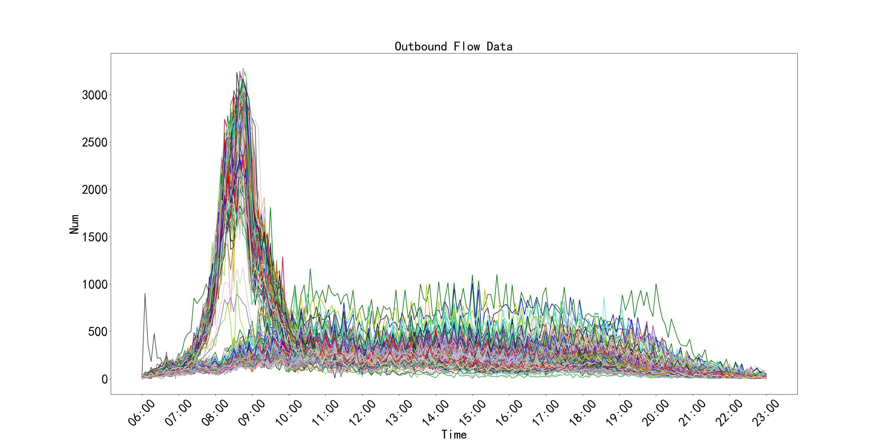

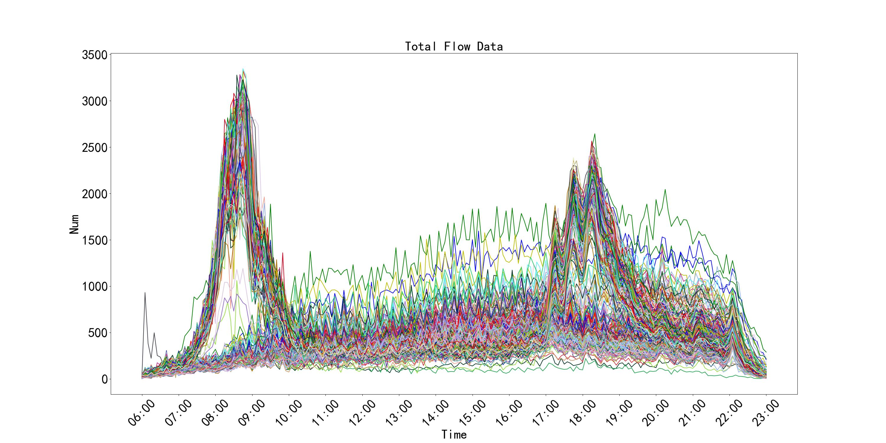

> The dataset is not public.

## Data pre-processing

### Remove abnormal data

Find abnormal data by clustering, and then we investigate the reason.
+ 20210418: A marathon race was held.
+ 20210701: A big event was held.
+ 20210726: Typhoon.
+ 20220129,20220130,20210210: Approaching important festivals

The following figtures show the curves of abnormal passenger flow data.

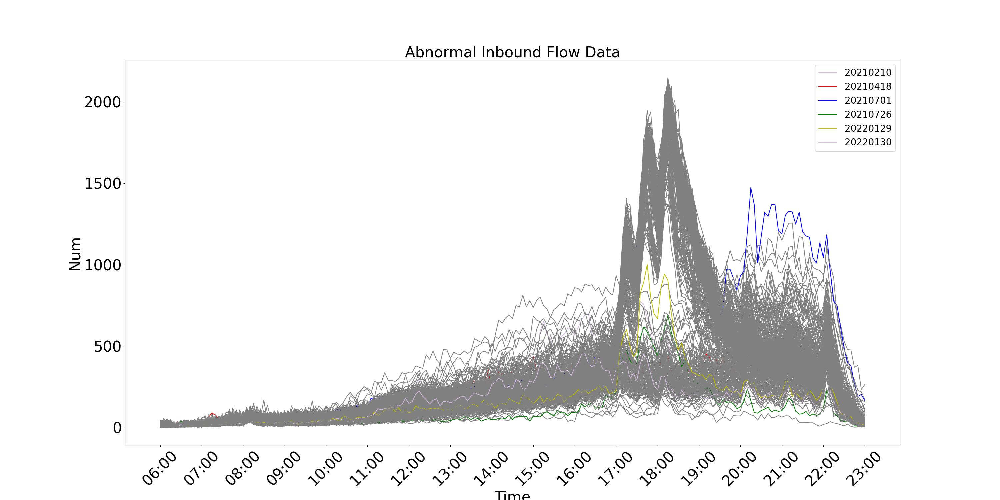

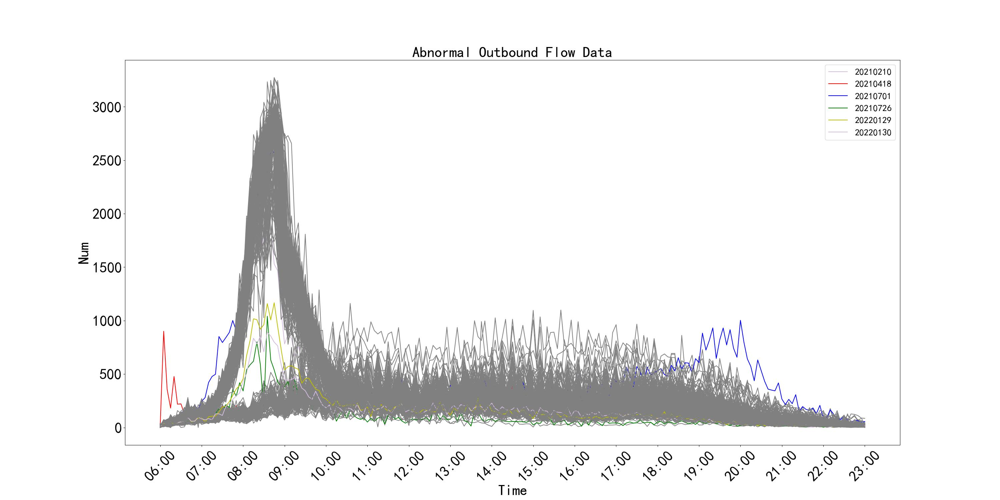

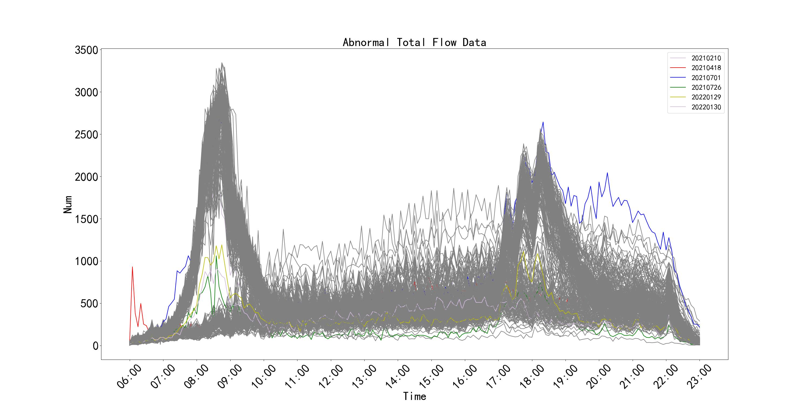

After removing, the dataset consists of 396 days of data and 205 pieces of data every day.

### Moving average smoothing

Use moving averages to smooth data.

The following figtures show the curves of the smoothed data.

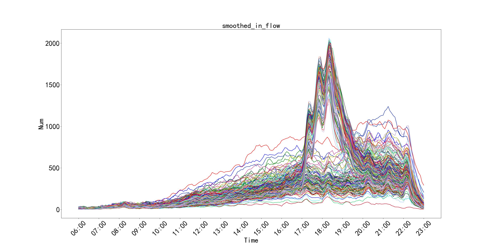

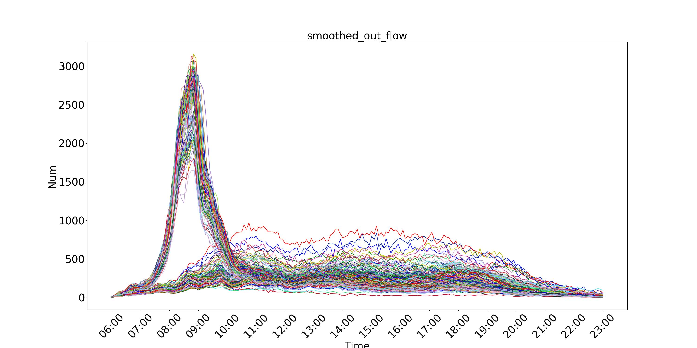

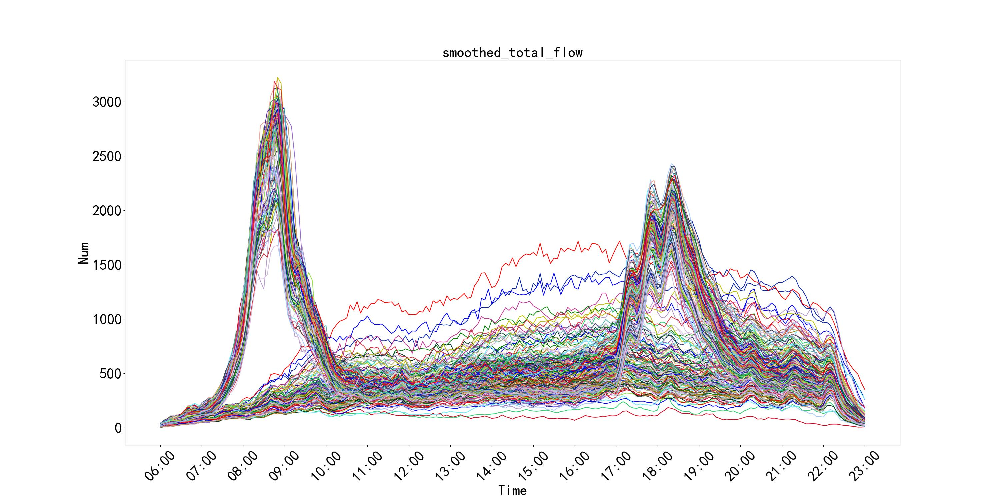

The following figture compares the original data and the smoothed data on a certain day.

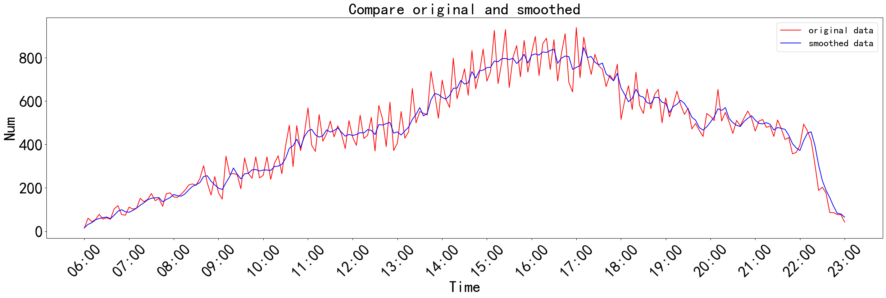

## Methodology
### Overall

### Clustering-Based Passenger Flow Time Series Feature Extraction

#### Passenger Flow Time Series Clustering

The purpose of clustering analysis is to classify data of a previously unknown structure into meaningful groupings. Clustering passenger flow data helps achieve a better understanding of the time series characteristics.

We select clustering algorithm (KMeans vs. Hierarchical Clustering) according to silhouette score.

The following figtures show the silhouette score of two algorithms.

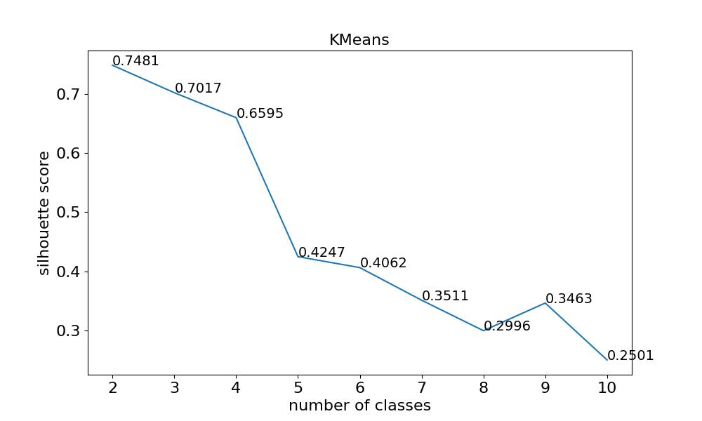

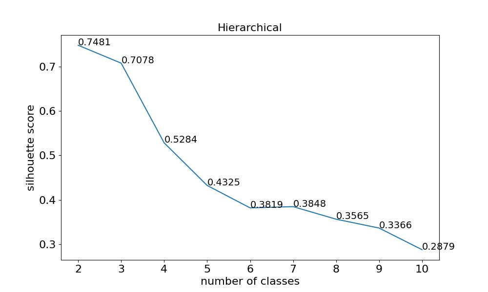

So we train a hierarchical clustering model and set `n_clusters=2`.

Then we analyse the date features of two classes. The result is as follows.

| Cluster | Date Feature | Number of Days |
| ---- | ---- | ---- |
| 0 | Holiday | 128 |
| 1 | Workday | 268 |

The following figture shows the curves of two classes.

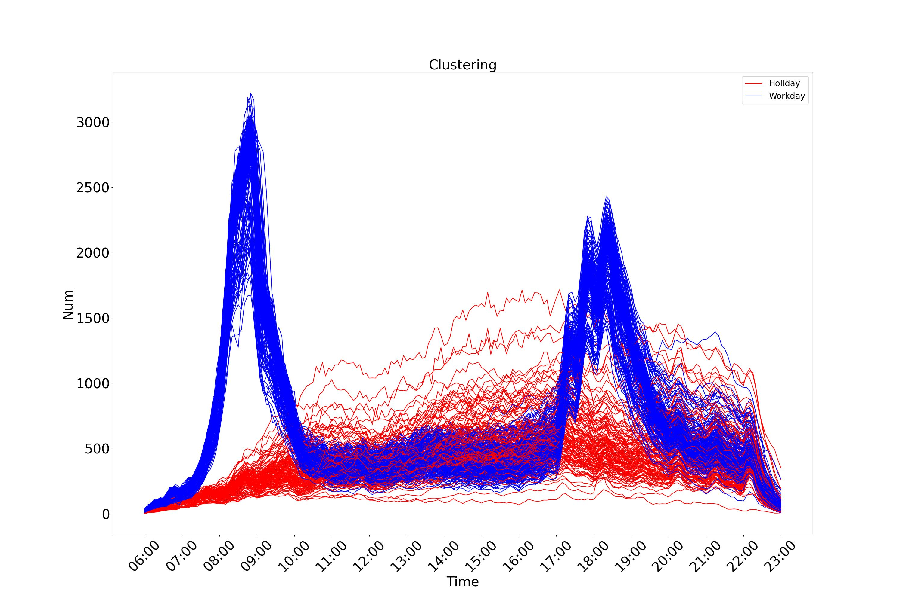

#### Time Series Feature Extraction based on Box-plot and IQR Method

According to the theory of the paper, we can extract the feature curves of two classes.

The following figtures show the feature curves of two classes.

After then, we can detect the abnormal flow according to the upper and lower bound curves.
