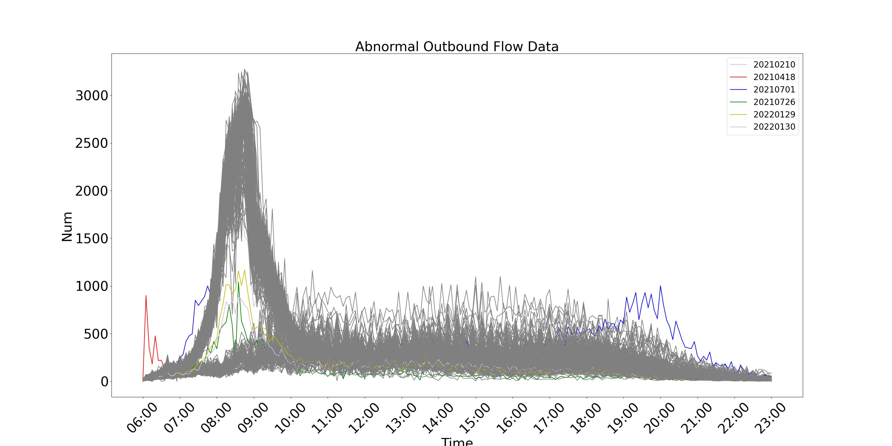
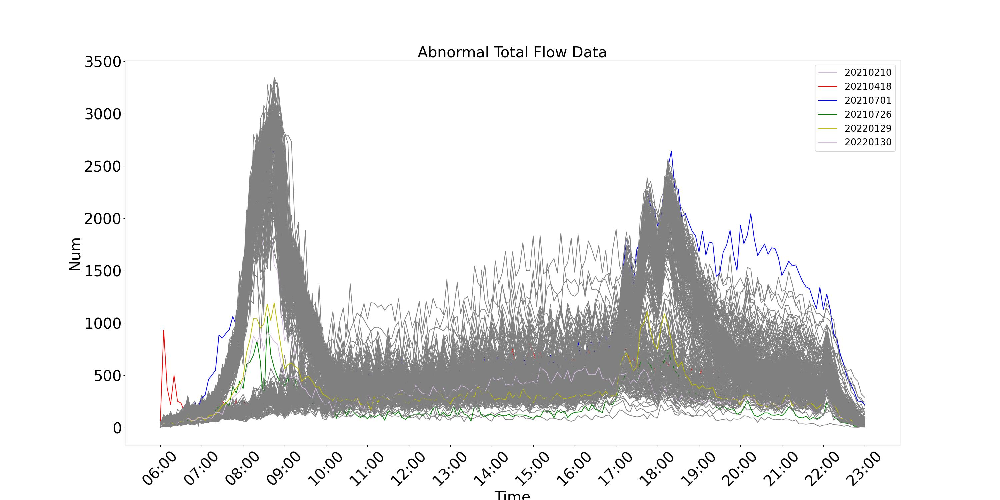
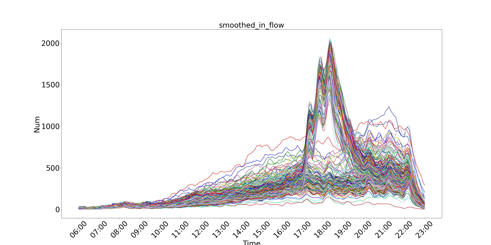

# Metro-Passenger-Flow-Anomaly-Detection
Reimplemention and improvement of the paper "[Real-Time Passenger Flow Anomaly Detection Considering Typical Time Series Clustered Characteristics at Metro Stations](https://ascelibrary.org/doi/abs/10.1061/JTEPBS.0000333)"

## Dataset

The AFC system records the number of passengers who are inbound to and outbound from stations. The passenger flow dataset collected from a metro station during 402 days, are utilized. The AFC data were collected at 5-min intervals.

Due to the varying operating hours of metro stations on different dates, in order to ensure unification of data, using daily data from 6:00 to 23:00.

The following figtures show the curves of the passenger flow data.

> The dataset is not public.

## Data pre-processing

### Remove abnormal data

Find abnormal data by clustering, and then we investigate the reason.
+ 20210418: A marathon race was held.
+ 20210701: A big event was held.
+ 20210726: Typhoon.
+ 20220129,20220130,20210210: Approaching important festivals

The following figtures show the curves of abnormal passenger flow data.

After removing, the dataset consists of 396 days of data and 205 pieces of data every day.

### Moving average smoothing

Use moving averages to smooth data.

The following figtures show the curves of the smoothed data.

The following figture compares the original data and the smoothed data on a certain day.

## Methodology
### Overall

### Clustering-Based Passenger Flow Time Series Feature Extraction

#### Passenger Flow Time Series Clustering ([clustering.ipynb](./clustering.ipynb))

The purpose of clustering analysis is to classify data of a previously unknown structure into meaningful groupings. Clustering passenger flow data helps achieve a better understanding of the time series characteristics.

We select clustering algorithm (KMeans vs. Hierarchical Clustering) according to silhouette score.

The following figtures show the silhouette score of two algorithms.

So we train a hierarchical clustering model and set `n_clusters=2`.

Then we analyse the date features of two classes. The result is as follows.

| Cluster | Date Feature | Number of Days |
| ---- | ---- | ---- |
| 0 | Holiday | 128 |
| 1 | Workday | 268 |

The following figture shows the curves of two classes.

#### Time Series Feature Extraction based on Box-plot and IQR Method

According to the theory of the paper, we can extract the feature curves of two classes.

The following figtures show the feature curves of two classes.

After then, we can detect the abnormal flow according to the upper and lower bound curves.

### Passenger Flow Prediction ([prediction.ipynb](./prediction.ipynb))

Use [Darts](https://github.com/unit8co/darts) to train a transformer model for passenger flow prediction.

The following figture compares the truth data and the predicted data of a certain time piece.

### Grading anomaly detection and warning

In the anomaly detection of passenger flow, in order to facilitate the control measures by stations, it is necessary to describe the degree of passenger flow anomalies more accurately and objectively. Therefore, graded anomaly detection is an important part, and scientific and reasonable graded anomaly detection indicators should be designed.

The size of passenger flow cannot be simply considered as reaching a certain scale, which means that the passenger flow is large or small. Due to the imbalance of passenger flow, the passenger flow may be large or small at different time periods and stations. However, this does not mean that the number of passenger flows in this situation is abnormal. The abnormal number of passenger flows should be relative to normal situations. Therefore, the identification of abnormal passenger flow should be based on historical data statistics to define a normal fluctuation range, and fluctuations beyond the normal range can be considered as abnormal passenger flow.

In order to reflect the relative anomalies of passenger flow at different time periods, it is necessary to give the normal range of passenger flow changes, and use the historical feature vector extraction method based on box plots mentioned earlier to determine the corresponding upper and lower limit feature curves and mean feature curves. The upper and lower limit feature curves are the boundaries of normal changes in passenger flow, and the mean feature curve is the average change law of passenger flow.

The grading of passenger flow  needs to consider two factors: the upper and lower limits of passenger flow and the duration. The upper and lower limits of passenger flow are set as grading criteria, with higher and lower limits respectively. The key parameter for calculating passenger flow limits is the data distribution probability $P$, which can be set according to the demand and calculate the corresponding upper and lower limits of probability $P$. Combined with the duration parameter, the level threshold of passenger flow indicators can be designed. Assuming that the passenger flow value that exceeds the range [$L_1$, $U_1$] is a relatively low degree of anomaly, and the passenger flow value that exceeds the range [$L_2$, $U_2$] is a relatively high degree of anomaly; Secondly, considering that short-term passenger flow anomalies do not have much reference value for station management, it is assumed that real-time passenger flow values exceed a certain threshold and persist for a certain period of time, and station managers need to be reminded.

We can design the tables of grading anomaly detection and warning as follows:

| Grade| Condition | Passenger flow status |
| ---- | ---- | ---- |
| Ⅲ(Yellow)| The passenger flow value is higher than $U_1$ at least for a period of $T_a$ or is lower than $L_1$ at least for a period of $T_b$ | Low level abnormal passenger flow requires timely monitoring |
| Ⅱ(Orange) | The passenger flow value is higher than $U_2$ at least for a period of $T_c$ or is lower than $L_2$ at least for a period of $T_d$ | Medium level abnormal passenger flow needs to be taken seriously |
| Ⅰ(Red) | The passenger flow value is higher than $U_1$ at least for a period of $T_e$ | High level abnormal passenger flow and immediate measures need to be taken |
